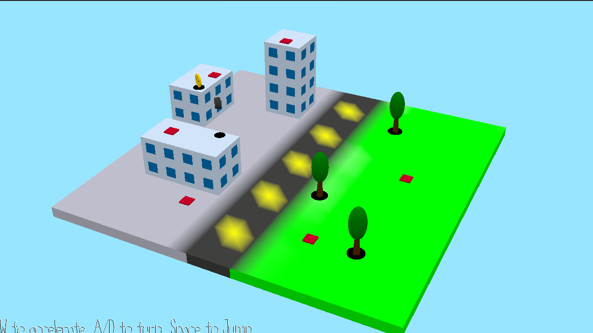

# Rubbapocalypse!

Author: Kenechukwu Echezona

Design: An arcade game where you roll around, avoid meteors (*currently bugged*), and collect medals to raise your score multiplier.

Screen Shot:

How To Play:

Controls:
- A/D: Turn counterclockwise/clockwise
- W: Accelerate
- J: Brake Charge (*currently bugged*, but you'd hold for ~2 seconds to release a Boost)
- Space: Jump

Goal:
- Gain points by moving! The more distance you cover, the more points you earn.
- Dodge meteors and the fire they leave behind (*currently bugged*)
- Collect medals to increase your score multiplier.

Strategies *(what would have been): 
- Meteors would have left a trail of flames when they crash, and these flame paths can intersect. It would have been go to slow down to traverse the environment more safely... or speed on through with quick jumps to preserve your combo meter.
- If a Spring launches you up and away from the arena, don't panic! Turn while charging a boost in the air, and you can make it back to the stage. You can even use this tactic to avoid meteors; just be sure you can land somewhere safe!
- Boost Hopping (or as I like to call it, "bopping") would have been a skill that arose from the physics I wrotre. Once your Boost ends, you'll gradually decelerate to your standard top speed on the ground. But in *Rubbapocalypse!*, you maintain most of your lateral momentum while airborne, so if you keep jumping with good timing, you can preserve the momentum of the Boost even after it ends... but only in one direction. Use it wisely to gain points and reach Medals faster, but watch where you're going!

This game was built with [NEST](NEST.md).
